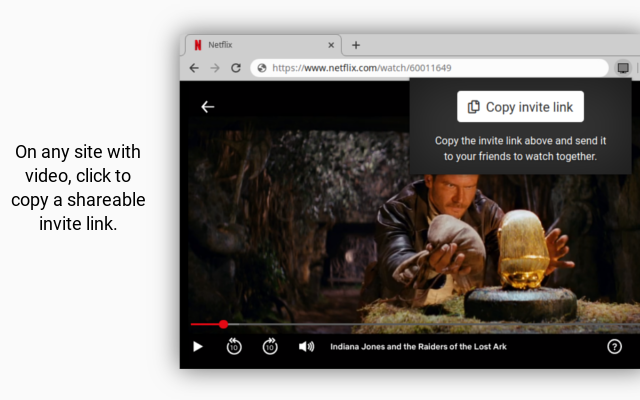

# Popcord

[Popcord](https://popcord.aduros.com) is a Chrome extension for watching video with friends remotely. Video playback is
synchronized for everyone watching together. No more countdowns to hit the play button!

Popcord was built with love during the 2020 quarantine to keep in touch with friends and family.

## Supported sites

- Netflix
- YouTube
- Vimeo
- Twitch
- And others! Popcord tries to handle any site that has video.

## Features

- Unlimited viewers: Any number of people can use an invite link to watch together at the same time.
- Shared navigation: Clicking on another episode or playlist video will send everyone else there too.
- Works on multiple sites: Even obscure ones.
- Simple and intuitive: No signup, no setup. Even friends and family members who aren't tech-savvy can use Popcord.
- Free forever: We'll never charge for access or new features.

## How to use

1. After adding Popcord to Chrome, click the TV icon in the address bar of any site with video to
   copy the invite link. The TV icon will light up to show you're connected and waiting.

2. Send the invite link to your friends. If they don't already have Popcord installed or permission
   is required by Chrome, the invite link will guide them. When they join, the TV icon will update
   to show they're present. Clicking it will show how many other people are watching.

3. Whenever someone pauses, plays, or seeks, Popcord keeps everyone's videos in sync.
